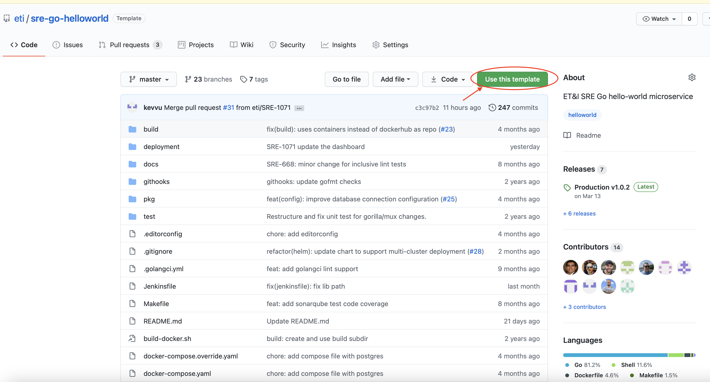
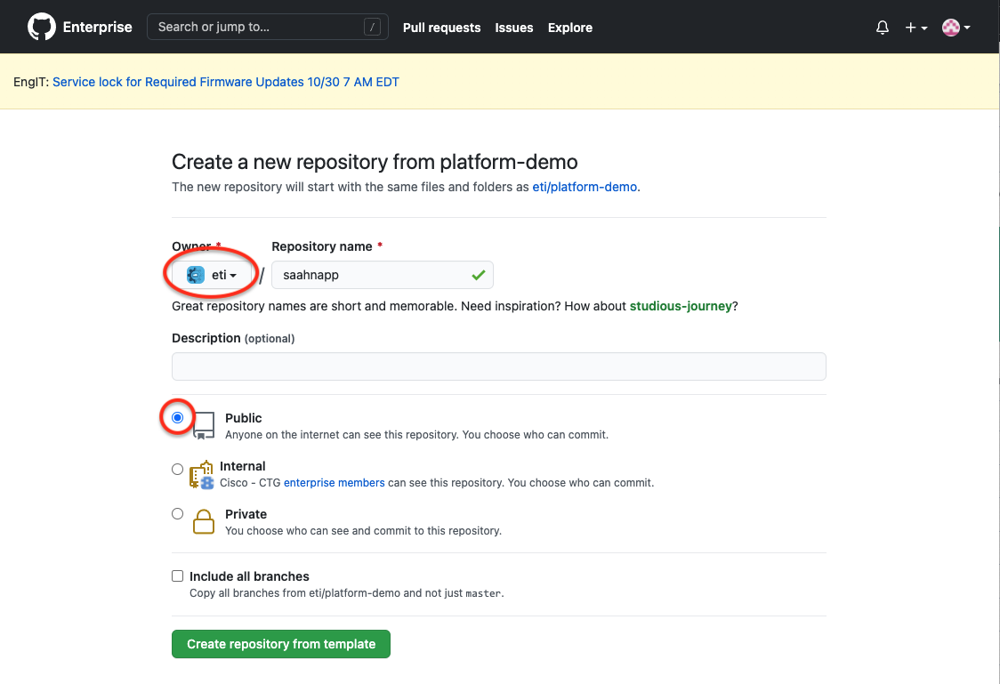

# ETI sre-go-helloworld

This project is to be used as a template for new Go based services. It provides
a light framework for how to structure your codebase, the build and deployment
components used in our CI/CD pipelines, and some boilerplate code used in many
of our services. Remember, this is a template and your use case might not need
everything provided. Delete what you don't need, because you can always come
back to this template for reference later.

This "boilerplate" Go microservice showcases the following features:

- CI/CD Setup
- Config Management
- Secrets Management
- Database Access
- HTTP Server Example
- Builds with Docker
- Deployment with Helm Charts
- Local dev environment with Docker Compose
- Lifecycle management of long running background jobs

## Quick Start

## How to use sre-go-helloworld as a template

1. Create a new repo from the template [sre-go-helloworld](https://github.com/cisco-eti/sre-go-helloworld) repo by clicking on the `Use this template` button on the upper right.
    
    * Select `cisco-eti` as the Owner and choose a short unique name for the repo (e.g., `<CEC_ID>app`). This repo name will be used as the default name for your new application.
    * Select `Public` visibility
    

1. Clone the new repo to your local development environment.
    ```
    git clone git@github.com:cisco-eti/<YOUR_APP_NAME>.git
    ```

1. `cd` into the repo and run the `runme.sh` to reconfigure the repo for your new application.
    ```shell
    ./runme.sh
    ```

1. The previous step should have created a new branch (named `<your app name>-<random string>`). Create a PR from that branch and merge it.

1. Reach out to SRE team in the [**Ask ET&I SRE**](https://eurl.io/#e7SKpvpKj) space to request a fully automated CI/CD pipeline for your new application

After the SRE creates the CI/CD pipeline and deploys your application, you can navigate to `https://<YOUR_APP_NAME>.int.dev.eticloud.io/` to see your deployed application.

See the [Troubleshooting](docs/troubleshooting.md) page if you run into any issues.

## sre-go-helloworld developer setup

## Quick links

- [Github Actions pipeline](https://github.com/cisco-eti/sre-go-helloworld/actions)
- [SonarQube project](https://sonar.us-east.devhub-cloud.cisco.com/dashboard?id=openg-go-helloworld&codeScope=overall)

## Instructions for Developers

### Install git hook to autoformat and run tests

From the main directory, run:

```bash
ln -s $(pwd)/.github/githooks/pre-commit .git/hooks/pre-commit`
```

## Source Code Structure

### /pkg

  This will contain the libraries internal to the app

### /docs

  If you need the swag tool, install it using command:

```bash
go get -u github.com/swaggo/swag/cmd/swag
go install github.com/swaggo/swag/cmd/swag
go mod tidy
```

  This contains the rest api specifications in JSON/ yaml. This specifications
  would be used for api documentation. Generated from handler comments using command:

```bash
swag init --parseDependency --parseInternal
```

  Then, if you want to play with the API, run the swagger docker container using:

```bash
docker run --name swagger_ui --rm -p 8080:8080 -e SWAGGER_JSON=/docs/swagger.json -v $(pwd)/docs:/docs swaggerapi/swagger-ui
```

Open a browser to the swagger UI [http://localhost:8080/](http://localhost:8080/), put http://localhost:5000/docs in the input
field and click on explore button.

### /build/

Contains most of the CI build artifacts

### /deploy/

This contains system and container orchestration, deployment configurations and templates.

### /.github/

This will have github specific configs, githooks (e.g. go_fmt, staticcheck etc.), contributions

### cmd/helloworld/main.go

This is the main package for the microservice.

### /woke/

Contains configurations related to inclusive linting


## Style Guide

Please refer to this style guide to keep code clean, readable, and consistent:
https://google.github.io/styleguide/go/best-practices


## Effective Go

Please refer to the following resources to produce effective, idiomatic,
readable code in Go:
- https://go.dev/doc/effective_go
- https://go-proverbs.github.io
- https://go.dev/talks/2013/bestpractices.slide
- https://go.dev/talks/2014/names.slide
- https://go.dev/talks/2014/readability.slide

More resources:
- https://dave.cheney.net/2020/02/23/the-zen-of-go
- https://rakyll.org/style-packages
- https://github.com/pthethanh/effective-go
- https://dmitri.shuralyov.com/idiomatic-go
- https://github.com/golang-standards/project-layout/issues/117

These are examples of big idiomatic projects:
- https://github.com/perkeep/perkeep
- https://github.com/tailscale/tailscale
- https://github.com/upspin/upspin
- https://github.com/robpike/ivy
