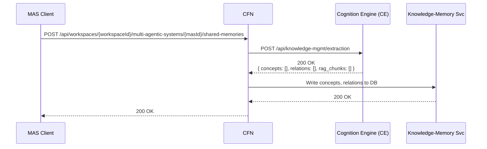
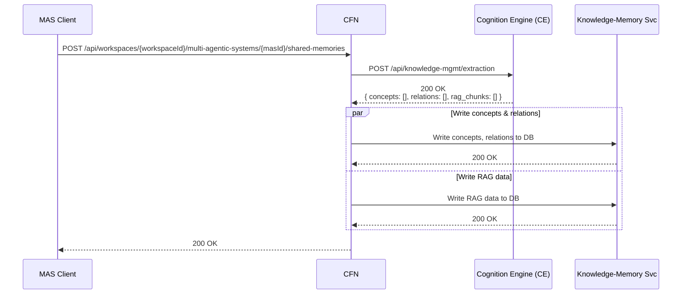
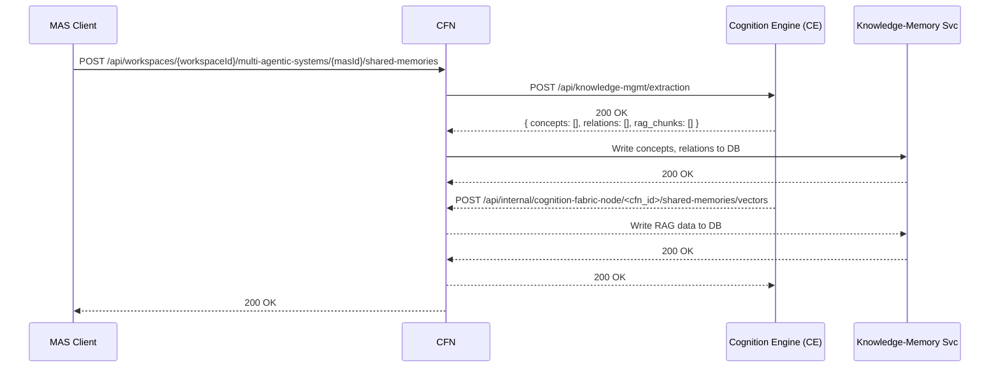

# Ingestion Workflow

## Current (Graph DB only)

```mermaid
sequenceDiagram
    participant MC as MAS Client
    participant CFN as CFN
    participant CE as Cognition Engine (CE)
    participant KM as Knowledge-Memory Svc

    MC->>CFN: POST /api/workspaces/{workspaceId}/multi-agentic-systems/{masId}/shared-memories
    CFN->>CE: POST /api/knowledge-mgmt/extraction
    CE-->>CFN: 200 OK<br/>{ concepts: [], relations: [], rag_chunks: [] }
    CFN->>KM: Write concepts, relations to DB
    KM-->>CFN: 200 OK
    CFN-->>MC: 200 OK
```

## With Vector DB for RAG

```mermaid
sequenceDiagram
    participant MC as MAS Client
    participant CFN as CFN
    participant CE as Cognition Engine (CE)
    participant KM as Knowledge-Memory Svc

    MC->>CFN: POST /api/workspaces/{workspaceId}/multi-agentic-systems/{masId}/shared-memories
    CFN->>CE: POST /api/knowledge-mgmt/extraction
    CE-->>CFN: 200 OK<br/>{ concepts: [], relations: [], rag_chunks: [] }
    par Write concepts & relations
        CFN->>KM: Write concepts, relations to DB
        KM-->>CFN: 200 OK
    and Write RAG data
        CFN->>KM: Write RAG data to DB
        KM-->>CFN: 200 OK
    end
    CFN-->>MC: 200 OK
```

## With this PR: https://github.com/cisco-eti/ioc-cfn-svc/pull/60

```mermaid
sequenceDiagram
participant MC as MAS Client
participant CFN as CFN
participant CE as Cognition Engine (CE)
participant KM as Knowledge-Memory Svc

    MC->>CFN: POST /api/workspaces/{workspaceId}/multi-agentic-systems/{masId}/shared-memories
    CFN->>CE: POST /api/knowledge-mgmt/extraction
    CE-->>CFN: 200 OK<br/>{ concepts: [], relations: [], rag_chunks: [] }
    CFN->>KM: Write concepts, relations to DB
    KM-->>CFN: 200 OK
    CE-->>CFN: POST /api/internal/cognition-fabric-node/<cfn_id>/shared-memories/vectors
    CFN-->>KM: Write RAG data to DB
    KM-->>CFN: 200 OK
    CFN-->>CE: 200 OK
    CFN-->>MC: 200 OK
```